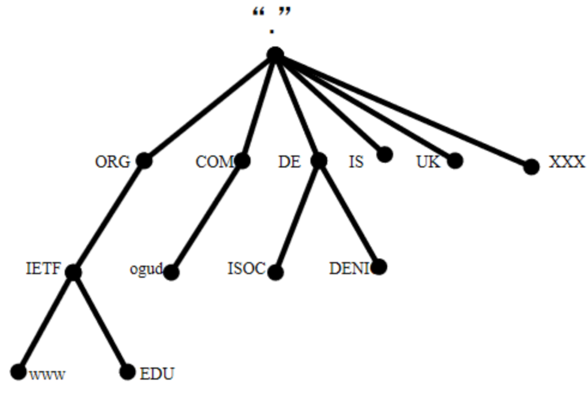
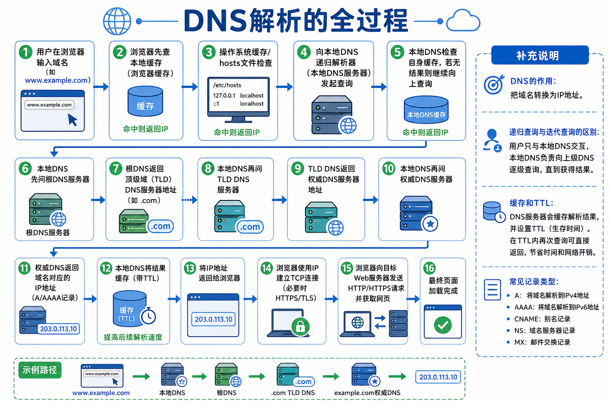

# 1. 什么是DNS

DNS 全称Domain Name System，域名系统，是一个记录域名和IP地址互相映射的一个系统，能够将用户访问互联网时使用的域名地址转成对应的IP地址，而不需要使用者去记住要访问的IP地址

通过域名解析得到对应的IP地址，这个过程称为域名解析

DNS通常运行于UDP协议之上，使用端口53，必要时也会使用TCP

## 1.1 域名结构解析



如上图所示，域名结构是树状结构的，树的最顶端代表根服务器，根的下层就是我们熟知的 .com, .net, .cn 等通用域和 .cn, .uk 等国家域组成，称为顶级域

域名结构一般是从右往左看：`主机名.二级域名.顶级域名`

就比如：`www.example.com`，就可以拆成`com`--顶级域名、`example`--二级域名、`www`子域名/主机名

## 1.2 DNS解析流程



对上图的关键流程进行描述一下，

1. DNS解析优先查询本机缓存，而不是立刻上网，大多数的请求其实不需要走完整的DNS链路，直接命中缓存就结束了
2. 本地的DNS负责递归查询，用户只把域名交给本地DNS，本次DNS继续问别人，直到拿到最终IP
3. 拿到IP之后，才开始真正建立TCP连接，如果是HTTPS还需要做TLS握手，然后才开始发送HTTP请求


权威服务器可以这样理解：

- 根 DNS：我不知道 www.example.com 的 IP，但我知道 .com 归谁管
- .com TLD DNS：我不知道具体 IP，但我知道 example.com 归哪些权威 DNS 服务器管理
- example.com 的权威 DNS：我知道，www.example.com = 203.0.111.10

所以，权威服务器的作用是保存域名的真实DNS记录，返回最终的解析结果


## 1.3 总结一下流程

就拿我自己的域名来举例naruto-blog.top，这个域名的NS配置指向dm1.longmingdns.com，服务器使用的腾讯云服务器，接下来看具体流程

1. 浏览器先查缓存，看自己有没有记录过这个域名的IP，有就直接用
2. 操作系统会继续查询本机 DNS 相关信息，例如本机 DNS 缓存和 `hosts` 文件；其中 Linux/macOS 的 `hosts` 文件通常是 `/etc/hosts`，Windows 通常是 `C:\Windows\System32\drivers\etc\hosts`
3. 把域名交给本地DNS，比如运营商DNS，路由器DNS，公共DNS
4. 本地DNS先问根DNS，它告诉我们`.top`该去问谁
5. 然后本地 DNS 再去问 `.top` 的 TLD DNS（管理 `.top` 这一层的 DNS 服务器），它告诉我们 naruto-blog.top 这个域名的 NS 是谁
6. 本地DNS去问权威DNS，也就是dm1.longmingdns.com，它保存着naruto-blog.top真实解析记录，naruto-blog.top的ip
7. 权威DNS返回结果，可能是A记录，也就是 www.naruto-blog.top的ip地址；也有可能返回`CNAME`，再继续查一次
8. 然后本地缓存结果
9. 浏览器拿着IP去访问服务器，建立TCP/TLS 连接，发送HTTP/HTTPS请求

# 2. 为什么需要DNS
**一句话：** DNS 的核心作用，是把“人好记的名字”变成“机器能找到的地址”，并且让这个地址可以随时变化而不影响用户访问

如果没有 DNS，会很麻烦：
- 你得记一堆 IP，不现实
- 服务器换 IP 后，用户收藏的地址就失效了
- 一个站点可能有多个 IP 做负载均衡、容灾，不能只靠手写地址
- 邮件、CDN、子域名、验证信息这些，也都需要统一管理

所以 DNS 解决的不是“查 IP”这么简单，而是：

- **把名称和地址解耦**
- **让服务迁移更自由**
- **让流量调度更灵活**
- **让互联网资源更容易管理**

# 3. 常见的DNS记录类型
- `A`: 域名指向IPv4地址
- `AAAA`: 域名指向IPv6地址
- `CNAME`: 别名记录，把一个域名指向另一个域名
- `NS`: 指定这个域名由哪些权威DNS服务器负责
- `MX`: 指定邮件服务器，用于收发邮件
- `TXT`: 存放文本信息，常用于 `SPF`, `DKIM`, `DMARC`, 域名验证
- `SOA`: 区域起始记录，描述这个DNS区域的基本信息
- `PTR`: 反向解析，把IP反查成域名
- `SRV`: 服务发现，告诉客户端某个服务在哪个机器，哪个端口
- `CAA`: 限制哪些证书机构可以给这个域名签发证书

可以把它理解成：DNS 不是单纯的“查 IP”，而是一套“按用途分工的地址与控制系统”。不同记录类型，本质上是在解决不同问题

## 3.1 各个记录类型的用处
### 地址映射
`A/AAAA` 负责“域名去哪台机器”。这是最基础的上网入口

### 别名跳转
`CNAME` 负责“这个名字其实是另一个名字”。适合把 www、活动页、第三方托管统一到同一目标上，避免重复维护多个 IP

例如：
- www.example.com 是官网
- promo.example.com 是活动页

DNS 可以这样配：
- promo.example.com -> CNAME -> promo-host.vercel.app
- lp.example.com -> CNAME -> promo-host.vercel.app

意思就是这两个名字都指向同一个活动页服务，以后活动页换服务器，只改`promo-host.vercel.app`这一处即可

还有第三方托管，就比如 GitHub Pages 和 Vercel

我们可以把自己的网站放到这些托管平台上，然后配置：
- docs.example.com -> CNAME -> username.github.io
- blog.example.com -> CNAME -> myblog.vercel.app

这样我们就能访问自己的域名，然后访问到托管平台上的资源或服务了

### 域名委派
`NS` 负责“这个子域归谁管”。比如把 api.example.com 交给另一套 DNS 系统维护，方便组织拆分和多团队管理

`NS` 可以理解成这个子域名以后谁说了算，它不是在说这个域名对应哪个IP，而是在说：
- 这个子域名的权威DNS服务器是谁
- 以后查询这个子域名的时候，应该去问谁

举个例子：

假设你的主域名是 example.com，官网DNS在阿里云，但是 api.example.com 由后端团队单独管理，放在腾讯云DNS

然后我们就需要这样做：
- 在 example.com 这层，添加 api.example.com 的 `NS` 记录，这个记录指向腾讯云提供的权威DNS，比如：ns1.tencentdns.com

然后腾讯云那边再配置真正的解析记录：
- api.example.com -> A -> 1.2.3.4

那么整个查询的过程就是这样的：
1. 用户访问 api.example.com
2. 递归DNS先问 example.com 的权威DNS
3. 权威DNS告诉我们 api.example.com 这个子域名归腾讯云管理，去问那几个NS
4. 再去腾讯云问真正的A记录
5. 拿到 1.2.3.4 IP地址

### 邮件路由
`MX` 负责邮件该发到哪台服务器，邮件和网站是两套系统，不能混在一个IP里简单处理

邮件发送的流程大概是：
1. 在邮件客户端里点发送
2. 邮件先发到“发件方邮件服务器”
3. 发件方服务器去查 qq.com 的 `MX` 记录
4. `MX` 告诉它：qq.com 的邮件应该投递到哪台邮件服务器
5. 再去查这台邮件服务器的 `A/AAAA` 记录，拿到 IP
6. 发件方服务器通过 `SMTP` 把邮件投递过去
7. 收件方服务器做反垃圾、校验 `SPF/DKIM/DMARC` 等
8. 通过后，把邮件存进 example@qq.com 的邮箱里
9. 你再用网页邮箱、APP 的 `IMAP/POP3` 去收取

DNS 在这里的作用：
- `MX`: 告诉别人邮件该找谁
- `A/AAAA`: 告诉别人这台邮件服务器的IP地址是多少
- `TXT`: 常用于 `SPF/DKIM/DMARC`，用来证明邮件服是不是可信

### 验证安全
`TXT/CAA` 这一类记录负责证明你是谁，谁能给你签证书，比如域名所有权验证，SPF/DKIM/DMARC，限制证书签发机构

### 反向查询
`PTR` 负责已知IP，反查它对应的域名，常用于邮件反垃圾，日志审计，风控校验

### 服务发现
`SRV` 负责某个服务器在哪个主机，哪个端口。适合不是标准的80/443端口的服务，比如IM，VoIP，内部微服务

这里重点说一下内部微服务这个场景，本质问题就是：**服务地址经常变，而且可能有很多台机器**
就比如公司内部有一个 `order-service` ，他可能不是只跑在一台服务器上，而是有3个实例：
- 10.0.1.11:8080
- 10.0.1.12:8080
- 10.0.1.13:8080

如果调用方写死了IP，就会导致，某台机器挂了，要改配置；扩容了，要新增地址；端口变了，也要改

这时候`SRV`的作用就是：我不直接告诉你服务在哪台机器，我告诉你这个服务的名字对应哪些机器和端口
```dns
_order._tcp.internal.example.com  SRV  10 50 8080  order1.internal.example.com
_order._tcp.internal.example.com  SRV  10 50 8080  order2.internal.example.com
```

调用方只要问 order 服务在哪？

DNS就返回：
- 主机名
- 端口
- 甚至还能返回优先级，权重

这样调用方就不用关心具体哪台机器了

这里的感觉和SpringCloud中的服务注册和发现是相同的思想，解决的是同一个问题，但SpringCloud通常不是靠DNS的SRV记录

更常见的是：
- `order-service` 注册到Eureka/Nacos
- `user-service` 去注册中心查 `order-service` 的实例列表
- 然后再做负载均衡调用

### 证书控制
`CAA` 负责允许哪些CA给我签证书，这是HTTPS时代关键的安全边界

# 4. DNS缓存与TTL
DNS 缓存就是：解析过一次的 DNS 结果，先临时存起来，下次再访问同一个域名时，不用重新走完整解析流程

比如第一次访问：
```txt
www.example.com -> 1.2.3.4
```

浏览器、操作系统、本地 DNS、运营商 DNS 都可能把这个结果缓存起来。下次再访问 www.example.com，如果缓存还没过期，就直接返回 1.2.3.4

TTL 全称 Time To Live，意思就是这条DNS记录可以缓存多久
```dns
www.example.com.  300  IN  A  1.2.3.4
```

在这 5 分钟内，递归 DNS 或客户端可以直接使用缓存结果，不必再次问权威 DNS

# 5. CNAME, CDN 和负载均衡
CNAME、CDN、负载均衡经常一起出现，是因为它们分别解决不同层面的问题：

- `CNAME`：把你的业务域名指向另一个域名
- `CDN`：把静态资源或页面分发到离用户更近的节点
- 负载均衡：在多个节点之间选择一个合适的服务实例

可以简单理解为：

你的域名 -> CNAME 到 CDN 域名 -> CDN 根据用户位置/线路/负载返回合适节点 IP

## 5.1 CNAME 在负载均衡中的作用
假设我们的域名是 www.example.com

接入CDN以后，CDN厂商通常不会让我们填一个固定的IP，而是给我们一个专属的域名：www.example.com.cdn-provider.com

然后我们在DNS中配置：

```dns
www.example.com.  CNAME  www.example.com.cdn-provider.com.
```

这样做的含义就是

```text
用户访问 www.example.com 时，先解析到 CDN 厂商提供的域名
真正返回哪个 IP，由 CDN 厂商继续决定
```

这样做的好处是：你的 DNS 不需要维护 CDN 节点 IP。CDN 厂商可以根据用户位置、运营商线路、节点健康状态、实时负载动态返回不同 IP

访问 www.example.com/logo.png 的流程大致如下：
1. 浏览器解析 www.example.com
2. DNS 发现它是 CNAME，指向 www.example.com.cdn-provider.com
3. 继续解析 CDN 域名
4. CDN 的 DNS 判断用户大概来自广州、电信网络
5. 返回一个广州或华南附近 CDN 节点 IP
6. 浏览器连接这个 CDN 节点
7. 如果节点有缓存，直接返回 logo.png
8. 如果节点没有缓存，CDN 回源到你的源站拉取资源，再缓存起来

# 6. DNS 劫持与污染
**DNS 污染和劫持，本质上都是DNS 返回结果被篡改了**

区别就是：
- **污染**：你本来想拿到正确解析结果，但在传输途中被塞了假的结果
- **劫持**：你的 DNS 查询流程被强行改道，或者返回结果被运营方/攻击者改写

## 6.1 DNS 污染
DNS 污染通常指：你查询一个域名时，网络中间有人伪造了一个错误的解析结果，让你拿到错误 IP

就比如，访问www.example.com，正常应该解析到1.2.3.4

但是却收到了6.6.6.6，然后浏览器就会连错目标，它的典型特点是：
- 返回的是假答案
- 明明查询的是正确域名，却被导向错误IP
- 常见于网络中间设备干预、缓存投毒、伪造响应

## 6.2 DNS劫持
DNS 劫持更像是整条查询链路被接管了

常见形式有两种：
原本想问 8.8.8.8，但路由器/运营商把请求改到了它自己的 DNS

我们的 DNS 请求还没到目标服务器，就被中途拦截并替换成别的结果

例如我们的手机/电脑设置了公共DNS：8.8.8.8

但实际发送出的DNS查询，被本地网络强制重定向到了运营商的DNS，这样我们看到的解析结果，就可能被修改了

# 7. 常用命令

## 7.1 nslookup
nslookup 比较简单，Windows、Linux、macOS 基本都能用。它适合快速看一个域名解析到了哪里

```bash
C:\Users\sherrly>nslookup www.baidu.com
```

输出：
```bash
C:\Users\sherrly>nslookup www.baidu.com
服务器:  UnKnown
Address:  10.194.115.7

非权威应答:
名称:    www.a.shifen.com
Addresses:  2408:8756:c52:15df:0:ff:b073:d207
          2408:8756:c52:1a18:0:ff:b030:7606
          157.148.69.151
          157.148.69.186
Aliases:  www.baidu.com
```
它告诉我们www.baidu.com解析到了哪个IP，使用了哪个DNS服务器（这里用到的是我自己电脑的DNS服务器）

我们也可以**自己指定DNS服务器**
```bash
nslookup www.baidu.com 8.8.8.8
```

输出：
```bash
C:\Users\sherrly>nslookup www.baidu.com 8.8.8.8
服务器:  dns.google
Address:  8.8.8.8

非权威应答:
名称:    www.a.shifen.com
Addresses:  2408:8756:c52:1a18:0:ff:b030:7606
          2408:8756:c52:15df:0:ff:b073:d207
          103.235.46.115
          103.235.46.102
Aliases:  www.baidu.com
```

另外，我们也可以查询指定记录类型
```bash
nslookup -type=NS naruto-blog.top
```

输出：
```bash
C:\Users\sherrly>nslookup -type=NS baidu.com
服务器:  UnKnown
Address:  10.194.115.7

非权威应答:
baidu.com       nameserver = ns3.baidu.com
baidu.com       nameserver = dns.baidu.com
baidu.com       nameserver = ns7.baidu.com
baidu.com       nameserver = ns2.baidu.com
baidu.com       nameserver = ns4.baidu.com

dns.baidu.com   internet address = 110.242.68.134
ns2.baidu.com   internet address = 220.181.33.31
ns3.baidu.com   internet address = 36.155.132.78
ns3.baidu.com   internet address = 153.3.238.93
ns4.baidu.com   internet address = 14.215.178.80
ns4.baidu.com   internet address = 111.45.3.226
ns7.baidu.com   internet address = 180.76.76.92
dns.baidu.com   AAAA IPv6 address = 240e:bf:b801:1002:0:ff:b024:26de
ns2.baidu.com   AAAA IPv6 address = 240e:940:603:4:0:ff:b01b:589a
ns7.baidu.com   AAAA IPv6 address = 240e:bf:b801:1002:0:ff:b024:26de
ns7.baidu.com   AAAA IPv6 address = 240e:940:603:4:0:ff:b01b:589a
```

## 7.2 dig
`dig` 是一个更专业的 DNS 查询工具，比 `nslookup` 输出更完整，适合看 TTL、记录类型、权威服务器、解析链路、指定 DNS 查询等信息

```bash
root@VM-0-7-ubuntu:~# dig google.com

; <<>> DiG 9.18.39-0ubuntu0.24.04.2-Ubuntu <<>> google.com
;; global options: +cmd
;; Got answer:
;; ->>HEADER<<- opcode: QUERY, status: NOERROR, id: 48857
;; flags: qr rd ra; QUERY: 1, ANSWER: 1, AUTHORITY: 0, ADDITIONAL: 1

;; OPT PSEUDOSECTION:
; EDNS: version: 0, flags:; udp: 65494
;; QUESTION SECTION:
;google.com.                    IN      A

;; ANSWER SECTION:
google.com.             154     IN      A       142.251.45.142

;; Query time: 0 msec
;; SERVER: 127.0.0.53#53(127.0.0.53) (UDP)
;; WHEN: Sun May 24 01:53:05 CST 2026
;; MSG SIZE  rcvd: 55

```

查询指定记录类型
```bash
root@VM-0-7-ubuntu:~# dig baidu.com A

; <<>> DiG 9.18.39-0ubuntu0.24.04.2-Ubuntu <<>> baidu.com A
;; global options: +cmd
;; Got answer:
;; ->>HEADER<<- opcode: QUERY, status: NOERROR, id: 6666
;; flags: qr rd ra; QUERY: 1, ANSWER: 4, AUTHORITY: 0, ADDITIONAL: 1

;; OPT PSEUDOSECTION:
; EDNS: version: 0, flags:; udp: 65494
;; QUESTION SECTION:
;baidu.com.                     IN      A

;; ANSWER SECTION:
baidu.com.              38      IN      A       110.242.74.102
baidu.com.              38      IN      A       111.63.65.103
baidu.com.              38      IN      A       124.237.177.164
baidu.com.              38      IN      A       111.63.65.247

;; Query time: 0 msec
;; SERVER: 127.0.0.53#53(127.0.0.53) (UDP)
;; WHEN: Sun May 24 01:54:23 CST 2026
;; MSG SIZE  rcvd: 102
```

只看结果，最常用的就是 `+short`
```bash
root@VM-0-7-ubuntu:~# dig baidu.com +short
111.63.65.103
124.237.177.164
110.242.74.102
111.63.65.247
```

也能指定DNS服务器查询
```bash
dig @8.8.8.8 www.baidu.com
dig @1.1.1.1 www.baidu.com
dig @114.114.114.114 www.baidu.com
```


